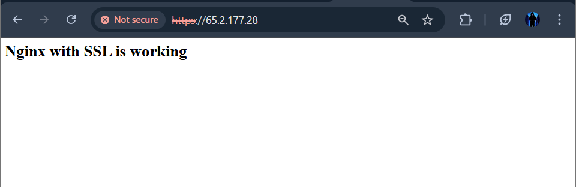
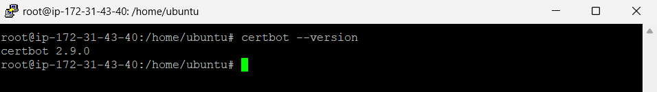
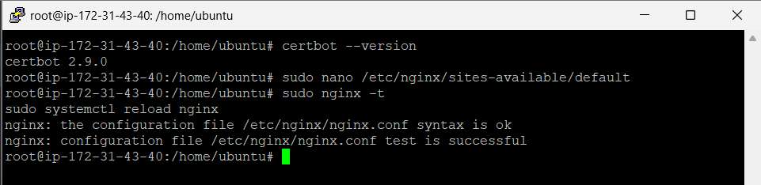
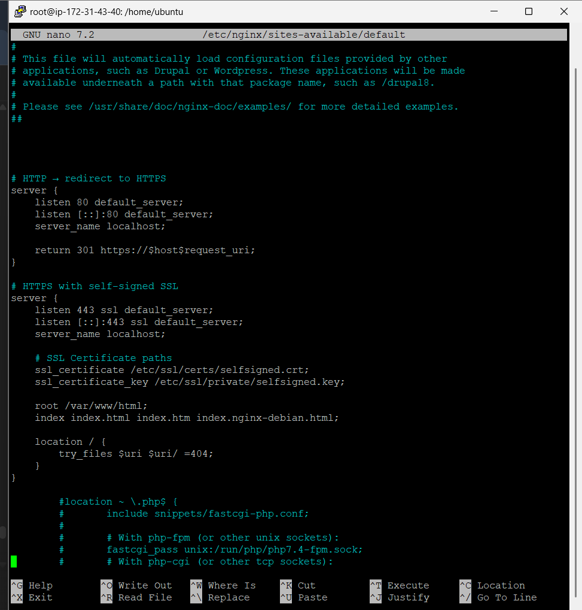
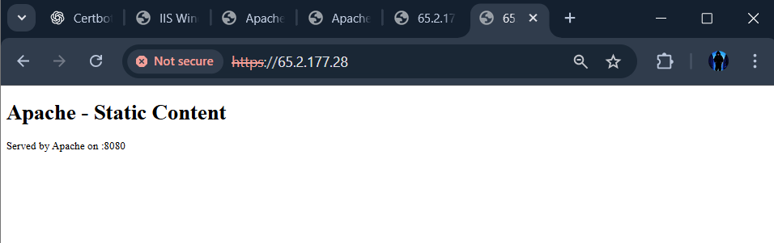
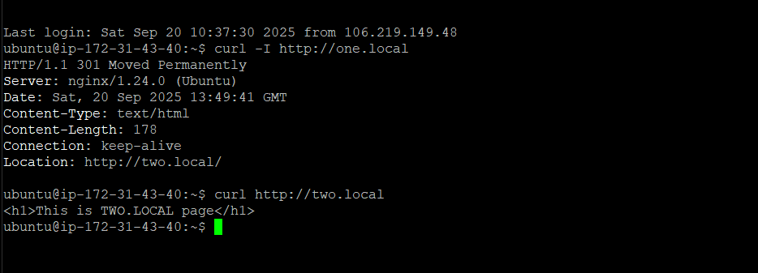
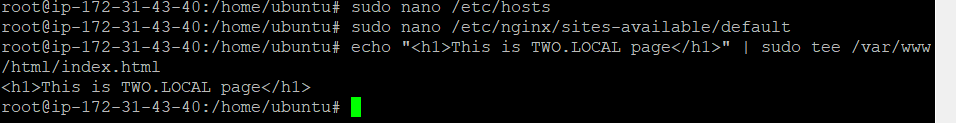

# devops-assignment
DevOps Assignment Tasks (Certbot SSL, Apache, Nginx, etc.)

# devops-assignment
            # Task 1 and 2 : Install Certbot SSL (Self-Signed Certificate with Nginx)

sudo apt update && sudo apt upgrade -y
Fetched 265 kB in 1s (302 kB/s)
Reading package lists... Done
Building dependency tree       
Reading state information... Done
0 upgraded, 0 newly installed, 0 to remove and 0 not upgraded.

Step 2: Install Certbot and Plugins
sudo apt install certbot python3-certbot-nginx python3-certbot-apache -y

Step 3: Verify Certbot Installation
certbot --version

Output:
certbot 2.9.0

Step 4: Generate Self-Signed SSL Certificate
sudo openssl req -x509 -nodes -days 365 -newkey rsa:2048 \
-keyout /etc/ssl/private/selfsigned.key \
-out /etc/ssl/certs/selfsigned.crt

Output (sample prompts):

Generating a RSA private key
writing new private key to '/etc/ssl/private/selfsigned.key'
-----
Country Name (2 letter code) [AU]: IN
State or Province Name (full name) [Some-State]: UttarPradesh
Locality Name (eg, city) []: Mathura
Organization Name (eg, company) [Internet Widgits Pty Ltd]: Flostat
Organizational Unit Name (eg, section) []: IT
Common Name (e.g. server FQDN or YOUR name) []: localhost
Email Address []: yogismash123@gmail.com

Step 5: Configure Nginx for SSL

Edit the default config:
sudo nano /etc/nginx/sites-available/default

Config added:
# Redirect HTTP to HTTPS
server {
    listen 80 default_server;
    listen [::]:80 default_server;
    server_name localhost;

    return 301 https://$host$request_uri;
}

# HTTPS with self-signed SSL
server {
    listen 443 ssl default_server;
    listen [::]:443 ssl default_server;
    server_name localhost;

    ssl_certificate /etc/ssl/certs/selfsigned.crt;
    ssl_certificate_key /etc/ssl/private/selfsigned.key;

    root /var/www/html;
    index index.html;

    location / {
        try_files $uri $uri/ =404;
    }
}

Step 6: Verify Content Served by Nginx

Replace the default index page:

echo "<h1>Nginx with SSL is working!</h1>" | sudo tee /var/www/html/index.html

Now open in browser:

https://65.2.177.28

Final Page Output:
Nginx with SSL is working!

                    📑 Task 3 — Server Response from Upstream Server using Nginx & Apache

                    
sudo ss -tulpn | grep 8080
curl -s http://127.0.0.1:8080 | head -n 5

Expected Output:

tcp   LISTEN 0      511    *:8080     *:*    users:(("apache2"...))
<!doctype html><html><body><h1>Apache - Static Content</h1>
Served by Apache on :8080
</body></html>

Step 2: Configure Nginx as Reverse Proxy
sudo nano /etc/nginx/sites-available/default

Configuration (replace content):

# Redirect HTTP → HTTPS
server {
    listen 80 default_server;
    listen [::]:80 default_server;
    server_name _;

    return 301 https://$host$request_uri;
}

# HTTPS reverse proxy to Apache backend
server {
    listen 443 ssl default_server;
    listen [::]:443 ssl default_server;
    server_name _;

    ssl_certificate /etc/ssl/certs/selfsigned.crt;
    ssl_certificate_key /etc/ssl/private/selfsigned.key;

    location / {
        proxy_pass http://127.0.0.1:8080;
        proxy_set_header Host $host;
        proxy_set_header X-Real-IP $remote_addr;
        proxy_set_header X-Forwarded-For $proxy_add_x_forwarded_for;
    }
}

Step 3: Test and Reload Nginx

sudo nginx -t
sudo systemctl reload nginx

Step 4: Verify Reverse Proxy Working
Command (curl test with SSL ignore):
curl -k -s https://127.0.0.1/ | head -n 5

Expected Output:
<!doctype html><html><body><h1>Apache - Static Content</h1>
Served by Apache on :8080
</body></html>

Step 5: Browser Test

Open in browser:
https://65.2.177.28

                        📑 Task 4 — Redirect Hit on Any Subdomain to Another Subdomain

objective :- to redirect the one request  of subdomain to another subdomain

Step 1: Hosts File Entry (Server side test ke liye)

Command:

sudo nano /etc/hosts

Added lines:
127.0.0.1 one.local
127.0.0.1 two.local

🔹 Step 2: Nginx Configuration for Redirect

Command:
sudo nano /etc/nginx/sites-available/default

Config Added:

# Redirect one.local → two.local
server {
    listen 80;
    server_name one.local;

    return 301 http://two.local$request_uri;
}

# Serve two.local
server {
    listen 80;
    server_name two.local;

    root /var/www/html;
    index index.html;

    location / {
        try_files $uri $uri/ =404;
    }
}

Step 3: Test & Reload Nginx

Command:

sudo nginx -t
sudo systemctl reload nginx

Expected Output:

nginx: the configuration file /etc/nginx/nginx.conf syntax is ok
nginx: configuration file /etc/nginx/nginx.conf test is successful

Step 4: Verify Redirect

Command 1:

curl -I http://one.local
Expected Output:

HTTP/1.1 301 Moved Permanently
Location: http://two.local/

Command 2:

curl http://two.local

Expected Output:
<h1>This is TWO.LOCAL page</h1>

